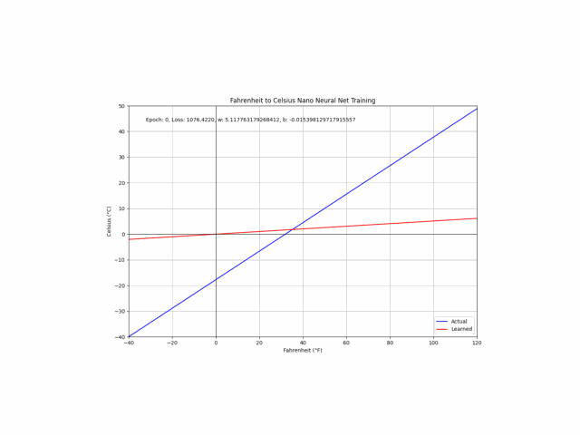

**Marcilio Mendonca**

PhD, ML Specialist, Sr. Solutions Architect at AWS

Hodwy!

I finally found some time to share this notebook I wrote a while back to teach neural nets from scratch to newbies. It contains the implementation of a nano neural net that learns the Fahrenheit-to-Celsius conversion function. It features forward and backpropagation (gradient descent) algorithm, basic normalization and hyperparameters such as learning rate and number of epochs. 

Feel free to mess with the code, add new layers, change the hyperparameters, etc., and see what happens. That's the best way to learn!

**Learning Animation**

The animation shows the nano neural network learning to convert Fahrenheit to Celsius through forward and backpropagation, adjusting its weights over multiple iterations.

